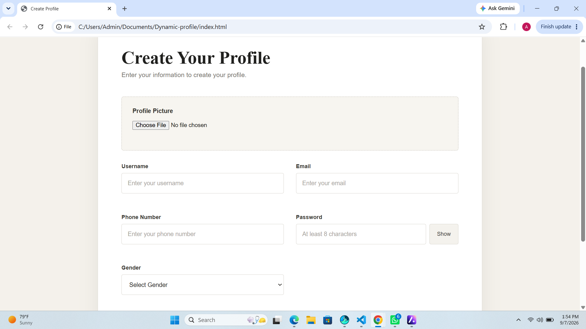
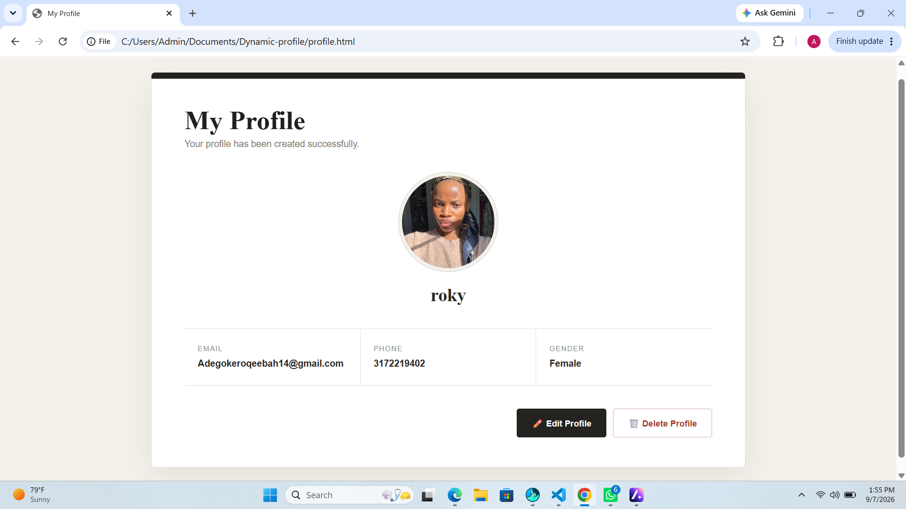
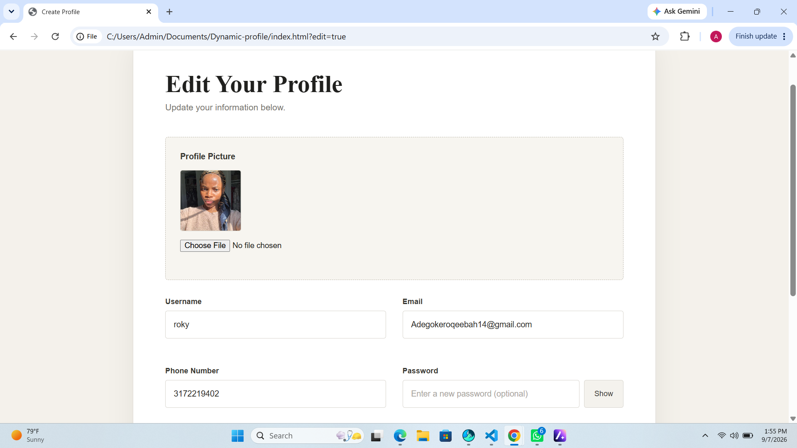

# Profile Management App

A responsive profile management application built with vanilla JavaScript. Users can create, view, edit, and delete their profile while their information persists using the browser's localStorage.

## Live Demo

[View Live Demo](YOUR-LIVE-DEMO-LINK)

## Preview

## Features

- Create a profile
- Client-side form validation
- Profile picture upload and preview
- Password show/hide functionality
- Save profile data with localStorage
- Profile dashboard
- Edit and update profile information
- Delete profile with confirmation
- Responsive design

## Technologies

- HTML5
- CSS3
- JavaScript
- DOM Manipulation
- LocalStorage API
- FileReader API

## What I Learned

- Dynamically creating and manipulating DOM elements with JavaScript
- Handling forms and user events
- Building client-side validation
- Working with objects and JSON
- Using localStorage for persistent data
- Using the FileReader API for image previews
- Managing data across multiple pages
- Implementing create, update, and delete functionality
- Building a responsive user interface

## Author

**Roqibat Adegoke**

Frontend Developer | UI/UX Enthusiast